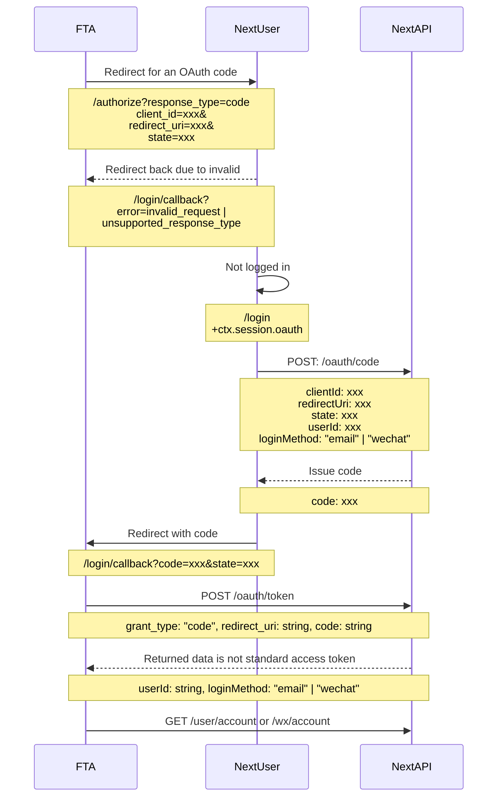

## Sequence

```mermaid
sequenceDiagram
    participant A as FTA
    participant U as NextUser
    participant API as NextAPI
    A->>U: Redirect for an OAuth code
    Note over A,U: /authorize?response_type=code<br/>client_id=xxx&<br/>redirect_uri=xxx&<br/>state=xxx
    U-->>A: Redirect back due to invalid
    Note over U,A: /login/callback?<br/>error=invalid_request |<br/>unsupported_response_type<br/>
    U->>U: Not logged in
    Note over U,U: /login<br/>+ctx.session.oauth
    U->>API: POST: /oauth/code
    Note over U,API: clientId: xxx<br/>redirectUri: xxx<br/>state: xxx<br/>userId: xxx<br/>loginMethod: "email" | "wechat"
    API-->>U: Issue code
    Note over API,U: code: xxx
    U->>A: Redirect with code
    Note over A,U: /login/callback?code=xxx&state=xxx
    A->>API: POST /oauth/token
    Note over A,API: grant_type: "code", redirect_uri: string, code: string
    API-->>A: Returned data is not standard access token
    Note over API,A: userId: string, loginMethod: "email" | "wechat"
    A->>API: GET /user/account or /wx/account
```
