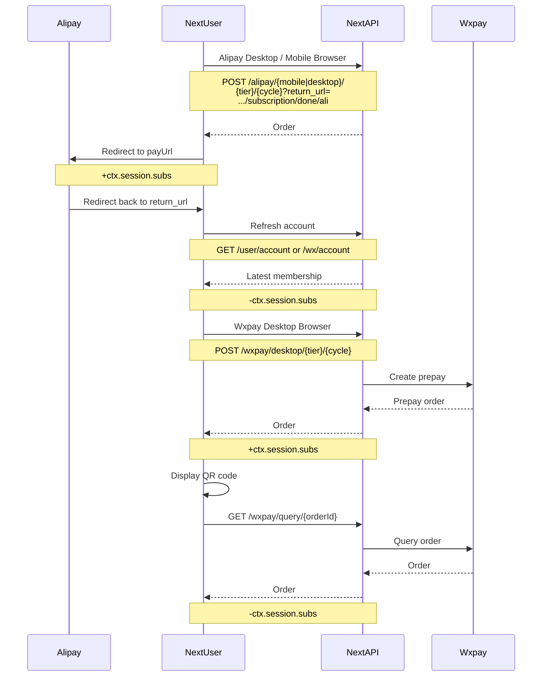

```mermaid
sequenceDiagram
    participant ALI as Alipay
    participant U as NextUser
    participant API as NextAPI
    participant WX as Wxpay
    U->>API: Alipay Desktop / Mobile Browser
    Note over U,API: POST /alipay/{mobile|desktop}/<br/>{tier}/{cycle}?return_url=<br/>.../subscription/done/ali

    API-->>U: Order

    U->>ALI: Redirect to payUrl
    Note over U,ALI: +ctx.session.subs

    ALI->>U: Redirect back to return_url

    U->>API: Refresh account
    Note over U,API: GET /user/account or /wx/account

    API-->>U: Latest membership
    Note over API,U: -ctx.session.subs

    U->>API: Wxpay Desktop Browser
    Note over U,API: POST /wxpay/desktop/{tier}/{cycle}

    API->>WX: Create prepay
    WX-->>API: Prepay order

    API-->>U: Order
    Note over API,U: +ctx.session.subs

    U->>U: Display QR code
    U->>API: GET /wxpay/query/{orderId}
    API->>WX: Query order
    WX-->>API: Order
    API-->>U: Order
    Note over API,U: -ctx.session.subs
```
