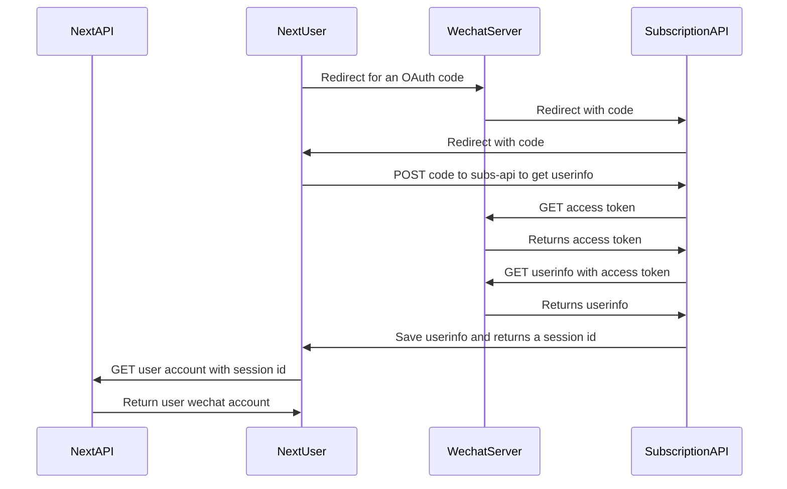
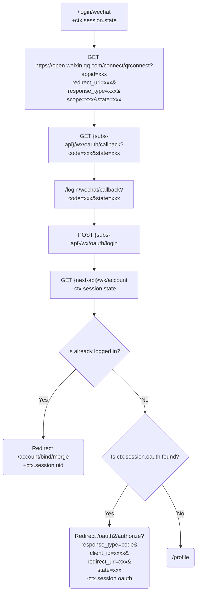

## Sequence

## Flow

Parameters to request for oauth code:

* `appid`
* `redirect_uri`: `http://www.ftacademy.cn/api/sandbox/wx/oauth/callback` or `http://www.ftacademy.cn/api/v1/wx/oauth/callback`
* `response_type=code`
* `scope=snsapi_login`
* `state` Random string
